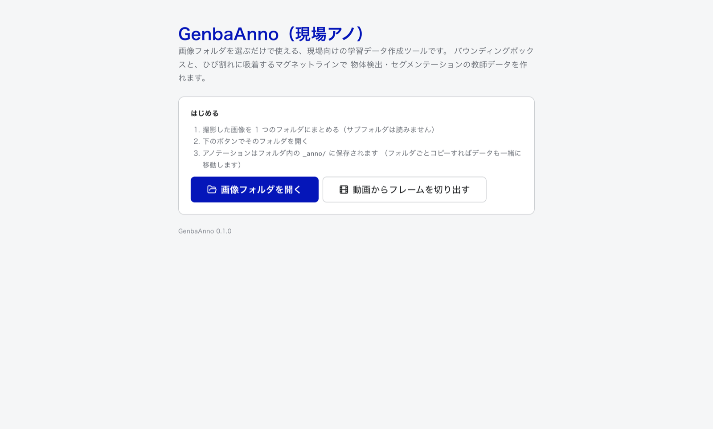
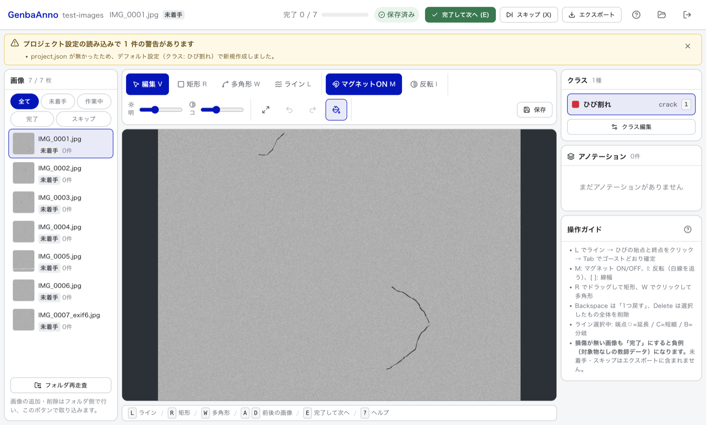
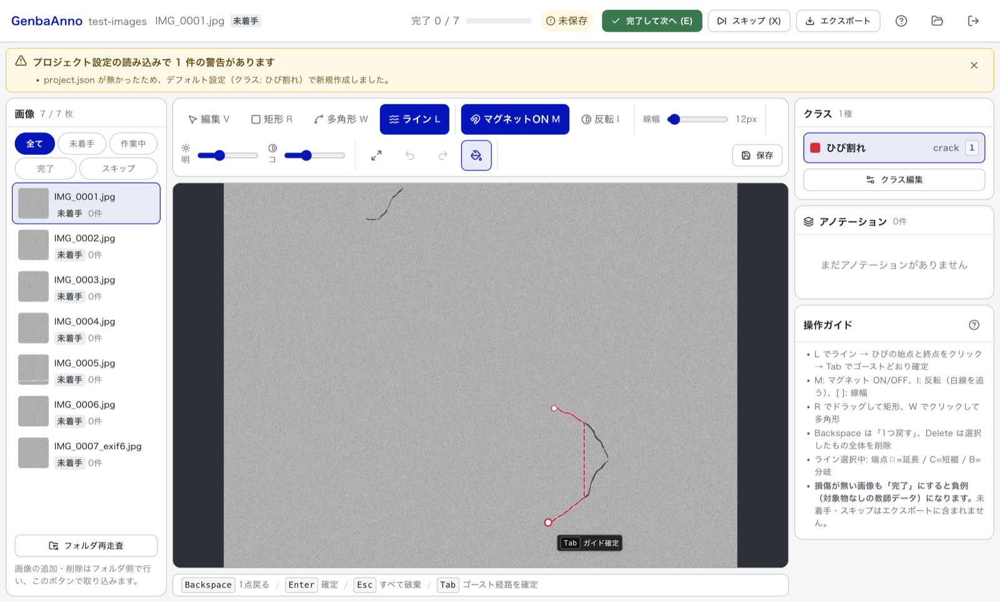
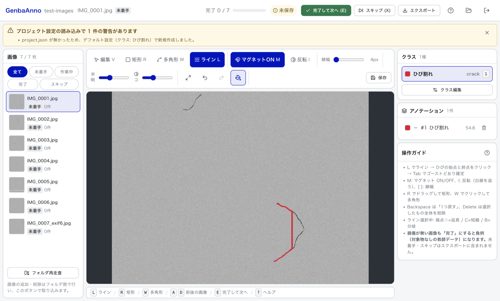
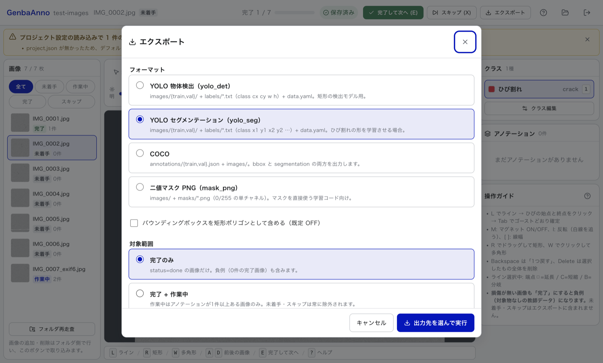

# GenbaAnno 操作マニュアル

**対象**: 現場でアノテーション（学習データ作り）を行う方
**関連**: [README](../README.md) / [データ形式・エクスポート仕様](FORMATS.md) / [開発者向け](DEVELOPMENT.md)

このマニュアルは、GenbaAnno を実際に操作するための手引きです。
インストール方法は [README のインストール](../README.md#インストール) を参照してください。

---

## 目次

1. [起動と画面構成](#1-起動と画面構成)
2. [基本ワークフロー](#2-基本ワークフロー)
3. [描画ツール](#3-描画ツール)
4. [ライン編集（延長・短縮・分岐・幅）](#4-ライン編集延長短縮分岐幅)
5. [編集モード（頂点の編集）](#5-編集モード頂点の編集)
6. [表示の調整](#6-表示の調整)
7. [ステータス運用（完了・スキップ・負例）](#7-ステータス運用完了スキップ負例)
8. [ショートカット一覧](#8-ショートカット一覧)
9. [保存・自動保存・バックアップ](#9-保存自動保存バックアップ)
10. [クラスの編集](#10-クラスの編集)
11. [動画からフレームを切り出す](#11-動画からフレームを切り出す)
12. [エクスポート](#12-エクスポート)
13. [トラブルシューティング](#13-トラブルシューティング)

---

## 1. 起動と画面構成

### 起動

GenbaAnno を起動すると「ようこそ」画面が開きます。



- **画像フォルダを開く** — 作業したい画像フォルダを選びます。
- **動画からフレームを切り出す** — 動画から画像を作ってから始めたいときに使います（→ [11 章](#11-動画からフレームを切り出す)）。
- **最近使ったフォルダ** — 一度開いたフォルダは一覧に残り、次からはワンクリックで開けます（最大 10 件）。

準備するフォルダのルール:

- 対応する画像は `.jpg` `.jpeg` `.png` `.webp` `.bmp` です。
- **サブフォルダの中は読み込みません。** 使いたい画像は 1 つのフォルダの直下に置いてください。
- 初めて開いたフォルダには、設定ファイル `_anno/project.json` が自動で作られます（クラスは「ひび割れ」1 種類が既定）。

### 画面構成



| 位置 | 内容 |
|---|---|
| **ヘッダ** | プロジェクト名 / 開いている画像名と状態 / 完了数の進捗バー / 保存状態（保存済み・未保存・保存中）/「完了して次へ (E)」「スキップ (X)」「エクスポート」/ ヘルプ・フォルダを開く・プロジェクトを閉じる |
| **警告バナー** | 読み込み時に問題があったときだけ、ヘッダの下に残り続けます（→ [13 章](#13-トラブルシューティング)） |
| **左パネル** | ステータスの絞り込み（全て / 未着手 / 作業中 / 完了 / スキップ）と画像一覧（サムネイル・状態・アノテーション件数）。下部に「フォルダ再走査」 |
| **中央** | ツールバー（ツール切替・マグネット・線幅・明るさ・コントラスト・フィット・元に戻す・塗り表示・保存）とキャンバス。最下部にその場面で使えるキーのヒントバー |
| **右パネル** | クラスパレット・アノテーション一覧・操作ガイド |

画像の追加や削除は **Finder / エクスプローラ側で行い**、左パネル下部の **「フォルダ再走査」** ボタンで取り込みます（アプリからは画像を削除できません。取り返しがつかない操作を避けるための仕様です）。

---

## 2. 基本ワークフロー

1. **フォルダを開く** — 「画像フォルダを開く」でフォルダを選ぶと、1 枚目の画像が自動で開きます。
2. **クラスを選ぶ** — 右のクラスパレットをクリック、または `1`〜`9` キー。クラスが 1 つだけなら何もしなくて構いません。
3. **描く** — `L` でライン、`R` で矩形、`W` で多角形（→ [3 章](#3-描画ツール)）。
4. **直す** — `V` で編集モードに切り替え、頂点や枠をドラッグして修正します（→ [5 章](#5-編集モード頂点の編集)）。
5. **完了にして次へ** — `E`。保存して「完了」にし、次の画像へ進みます。
   **損傷が写っていない画像も `E` で完了にしてください**（→ [7 章](#7-ステータス運用完了スキップ負例)）。
6. **全部終わったらエクスポート** — ヘッダの「エクスポート」（→ [12 章](#12-エクスポート)）。

前後の画像へは `←` `→`（または `A` `D`）で移動します。未保存の変更があれば自動で保存してから切り替わります。

---

## 3. 描画ツール

ツールのキーを押すと、そのツールの**描画モード**に切り替わります。`V` を押すと**編集モード**に戻ります。

### 3-1. マグネットライン（`L`）— ひび割れなど細長い対象の主力ツール

ひび割れの**中心線**をなぞると、線幅ぶんの太さを持つ帯（リボン）状のポリゴンが自動生成されます。
**マグネット**が ON（既定）のときは、クリックした 2 点の間を**画像の暗い筋に沿って自動でトレース**します。

> **マグネットの中身について**
> 画素の明るさをもとに「暗いところを通る最短経路」を探す古典的な画像処理（livewire）です。
> **機械学習は使っていません。** ひび割れを自動で見つけてくれる機能ではなく、**あなたがクリックした 2 点の間の線の引き方を助ける入力補助**です。

#### いちばん速い使い方: 1 クリック + カーソル + `Tab`

1. `L` を押します（ラインツール。既定で選ばれています）。
2. **ひび割れの始点を 1 回クリック**します。
3. **カーソルを終点あたりへ動かします。** カーソルの方向と距離に応じて自動スナップした終点までの経路が、**赤い半透明のゴースト**（帯 + 破線の中心線 + 終点マーカー）として表示されます。カーソルの脇に「`Tab` ガイド確定」のチップが出ます。
4. **`Tab` を押します。** **表示されているゴーストのとおりに**区間が追加され、そのままラインが 1 本確定します。



`Tab` で確定した直後の状態です。中心線に沿った帯状のポリゴンになります。



#### クリックを重ねる使い方（長いひび・曲がったひび）

始点をクリックしたあと、**通り道の要所を順にクリック**していくこともできます。クリックのたびに、直前の点からその点までがマグネットでトレースされて追加されます。最後に `Enter` を押すと確定します。

- ゴーストの `Tab` 確定と、クリックを重ねる方法は自由に混ぜて使えます。
- クリック位置が直前の点に近すぎるとき（画面上で 3px 未満）はトレースせず、普通に頂点が 1 つ追加されます。

#### 描いている途中の操作

| キー | 動作 |
|---|---|
| `Tab` | 表示中のゴーストどおりに区間を追加して、そのまま確定 |
| `Enter` | ここまでで確定（中心線 2 点以上が必要） |
| `Backspace` | **1 つ戻す。** マグネットで引いた区間は**1 区間まとめて**戻ります（連打で最初の 1 点まで遡れます。戻ったあと、そこから描き直せます） |
| `Esc` | **描いている途中のライン全体を破棄** |

キャンバス下部のヒントバーに、この 4 つが常に表示されます。
**`Backspace` は「1 つ戻す」、`Esc` は「全部やめる」** と覚えてください。

#### マグネットの設定

| キー | 動作 |
|---|---|
| `M` | マグネットの ON / OFF。OFF にすると、クリックした点を直線で結ぶ普通のライン描画になります |
| `I` | **反転モード** の ON / OFF。既定のマグネットは「暗い線」を追いますが、反転すると**白線など明るい線**を追うようになります（区画線・チョーク跡など）。マグネットが ON のときに効きます |
| `[` `]` | 線幅を 2px ずつ細く / 太く（4〜200px） |

マグネットと反転の設定は `_anno/project.json` に保存され、次にそのフォルダを開いたときの初期値になります。

#### 線幅と「可変幅テーパー」

- ラインの太さは、ツールバーの**線幅スライダー**または `[` `]` で変えられます（画像のピクセル単位）。
- マグネットで引いた区間では、**各点ごとにひび割れの実際の太さを推定**して、点ごとに太さの違う帯（テーパー）を作ります。手前が太く奥が細いひび割れも、実形状に近い形になります。
- 最初のマグネット区間を引いたとき、推定された太さが**線幅の初期値として自動でセット**されます。
- `[` `]` やスライダーで幅を変えると、**テーパーの形を保ったまま全体が拡大縮小**します（一様な太さに潰れることはありません）。

### 3-2. 矩形 / バウンディングボックス（`R`）

- `R` を押して、**対象を囲むようにドラッグ**します。離した時点で 1 つのアノテーションになります。
- 縦横どちらかが 3px 未満の小さすぎる矩形は作られません（誤クリック対策）。
- 確定後は編集モード（`V`）で選択すると、**四隅と四辺中央の 8 個のハンドル**でリサイズ、**内側をドラッグ**で移動できます。

### 3-3. 多角形（`W` または `N`）

- クリックで頂点を 1 つずつ置いていきます。
- **確定**: 最初の頂点をクリック（3 点以上必要）/ ダブルクリック / `Enter`。
- `Backspace` で直前の頂点を 1 つ取り消し、`Esc` で描画中のものを全部破棄します。
- 亀甲状のひび割れ・穴・面的な損傷など、線ではなく面で囲みたい対象に向いています。

---

## 4. ライン編集（延長・短縮・分岐・幅）

マグネットラインで作ったアノテーションは、**中心線・点ごとの幅・分岐**という構造を内部に持っています。
そのため確定したあとでも「線」として編集でき、そのつどポリゴンが自動で作り直されます。

**編集モード（`V`）でラインをクリックして選択**すると、中心線（白い点線）・**端点の ◻ ハンドル**・ツールバーの「短縮」「分岐」ボタン・線幅スライダーが表示されます。

| 操作 | やり方 |
|---|---|
| **延長** | 端点の **◻ をクリック** → そのままマグネットで続きを描く → `Enter` で確定 |
| **短縮** | `C`（またはツールバーの「短縮」）→ **中心線をクリック**して切る位置を指定 → 出てきたボタンで **「始点側を残す」/「終点側を残す」** を選ぶ<br>分岐（枝）の上をクリックした場合は **「付け根側を残す」/「分岐を削除」** になります |
| **分岐** | `B`（またはツールバーの「分岐」）→ **中心線をクリック**して枝の付け根を指定 → 枝を描いて `Enter`。分岐を含めて**1 つのアノテーション**として扱われます |
| **線幅の変更** | 線幅スライダー、または `[` `]`。テーパーの形を保ったまま全体がスケールします |
| **末尾の点を 1 つ削除** | `Backspace`。押すたびに中心線の末尾の点が 1 つ消え、ポリゴンが作り直されます。分岐があるときは新しい枝の末尾から消えます |
| **まるごと削除** | `Delete`（`Ctrl` / `Cmd` + `Z` で元に戻せます） |

`C` や `B` は**次の 1 クリックだけ**有効です。別の場所をクリックするか `Esc` を押すと解除されます。

> **注意**: ライン上の頂点を直接ドラッグ・挿入・削除すると、**ライン構造（幅変更・延長・短縮・分岐）は解除**され、ただの多角形になります。
> 解除されたときは「頂点を編集したためライン構造を解除しました」というメッセージが出ます。形は保たれるので、そのまま多角形として使えます。

---

## 5. 編集モード（頂点の編集）

`V` を押すと編集モードになります。アノテーションをクリックして選択してから操作します。

| 操作 | 動作 |
|---|---|
| クリック | 選択（細長い図形は輪郭線のクリックでも選べます） |
| **頂点をドラッグ** | 頂点を移動 |
| **輪郭線をダブルクリック** | その位置に頂点を挿入 |
| **頂点を右クリック** | 頂点を削除（3 点まで減ると削れません） |
| **内部または輪郭線をドラッグ** | 図形全体を移動 |
| **矩形の 8 ハンドルをドラッグ** | 矩形のリサイズ（四隅・四辺中央） |
| `Backspace` | 末尾の点を 1 つ削除（ライン = 中心線の末尾 / 多角形 = 末尾の頂点。多角形は 4 点以上のときだけ） |
| `Delete` | 選択中のアノテーションを丸ごと削除 |
| `1`〜`9` | 選択中のアノテーションのクラスを変更 |

削除しても `Ctrl` / `Cmd` + `Z` で元に戻せます（100 手前まで）。

---

## 6. 表示の調整

| 操作 | 動作 |
|---|---|
| `Ctrl` / `Cmd` + ホイール、Mac のピンチ | ズーム（カーソルを中心に拡大縮小） |
| ホイール / `Space` + ドラッグ / マウス中ボタンドラッグ | 画面の移動（パン） |
| `F` | 画面にフィット |
| `T` | 塗りつぶし表示の ON / OFF |
| ツールバーの「明」「コ」スライダー | 明るさ・コントラスト。**薄いひび割れを見つけるための表示用**で、画像ファイル自体やアノテーション座標は変わりません |

---

## 7. ステータス運用（完了・スキップ・負例）

各画像には次の 4 つの状態があり、左パネルの一覧とヘッダにバッジで表示されます。

| 状態 | いつなるか | エクスポート |
|---|---|---|
| **未着手**（`pending`） | まだ一度も保存していない | **含まれません** |
| **作業中**（`in_progress`） | 保存すると自動的にこの状態になる | 「完了 + 作業中」を選んだときだけ、かつ**アノテーションが 1 件以上ある場合のみ**含まれます |
| **完了**（`done`） | `E` キー / 「完了して次へ」ボタン | 含まれます |
| **スキップ**（`skipped`） | `X` キー / 「スキップ」ボタン | **含まれません** |

### 損傷が写っていない画像の扱い（重要）

**対象物が何も写っていない画像も、`E` で「完了」にしてください。**

アノテーションが 0 件のまま「完了」にした画像は、**負例**（＝「ここには対象物が無い」と教える教師データ）として書き出されます。負例が無いデータセットで学習させると、モデルが何もない場所を誤検出しやすくなります。

一方、

- **未着手**（まだ触っていない）
- **スキップ**（ピンボケ・対象外など、学習に使いたくない画像）

はエクスポートに**一切含まれません**。「見たけど何も無かった」画像を未着手のまま残すと、貴重な負例が捨てられてしまいます。**見て何も無かったら完了、使いたくない画像はスキップ**、と使い分けてください。

`X`（スキップ）を押したとき、未保存の変更があれば破棄してよいか確認されます。スキップはディスク上の状態だけを書き換えるので、**未保存の変更が勝手に保存されることはありません**。

---

## 8. ショートカット一覧

アプリ内では `?` または `H` でいつでも表示できます。
**テキスト入力欄にカーソルがあるときは、これらのショートカットは効きません。**

### ツール

| キー | 動作 |
|---|---|
| `R` | バウンディングボックス（ドラッグで描画・8 ハンドルでリサイズ） |
| `W` / `N` | 多角形（クリックで頂点追加・始点クリック / `Enter` で確定） |
| `L` | ライン（マグネットライン。既定ツール） |
| `V` | 編集モード |
| `M` | マグネット ON / OFF（暗い筋に吸着） |
| `I` | 反転モード ON / OFF（白線など明るい線を追う） |
| `1`〜`9` | クラス選択（選択中のアノテーションのクラスも変わります） |

### 描画中

| キー | 動作 |
|---|---|
| `Tab` | マグネットのゴースト経路をそのまま確定（1 クリック + カーソル + `Tab` で 1 本） |
| `Enter` | 描画中のものを確定 |
| `Backspace` | 1 つ戻す（マグネットは 1 区間ずつ） |
| `Esc` | 描画を破棄 → 選択解除 → 編集モード（この順に効きます） |

### 選択中

| キー | 動作 |
|---|---|
| 端点 ◻ クリック | ラインを延長（続きを描いて `Enter`） |
| `C` | ラインの短縮（中心線をクリックして切断位置を指定） |
| `B` | ラインの分岐（中心線をクリックして枝を描く） |
| `[` / `]` | 線幅 − / ＋（テーパー形状を保ったまま全体スケール） |
| `Backspace` | ライン = 末尾の中心線点 / 多角形 = 末尾頂点を 1 つ削除 |
| `Delete` | 選択中のアノテーションを全体削除（`Ctrl` + `Z` で戻せます） |

### 画像・保存

| キー | 動作 |
|---|---|
| `←` / `→`、`A` / `D` | 前 / 次の画像（未保存なら自動保存してから切替） |
| `E` | 保存して完了にし次へ（損傷が無い画像も完了にすると負例になります） |
| `X` | スキップにして次へ（エクスポート対象外） |
| `Ctrl` / `Cmd` + `S` | 保存（30 秒ごとの自動保存もあります） |
| `Ctrl` / `Cmd` + `Z` | 元に戻す（`Shift` を足すとやり直し） |

### 表示

| キー | 動作 |
|---|---|
| `F` | 画面にフィット |
| `T` | 塗りつぶし表示の切替 |
| `Ctrl` / `Cmd` + ホイール | ズーム（カーソル中心） |
| `Space` + ドラッグ / 中ボタン / ホイール | パン |
| `?` / `H` | ショートカット一覧の開閉 |

---

## 9. 保存・自動保存・バックアップ

### 保存されるタイミング

- `Ctrl` / `Cmd` + `S`、またはツールバーの「保存」ボタン
- **変更してから 30 秒後**（自動保存。失敗したら再試行します）
- **前後の画像へ移動するとき**（自動保存。失敗した場合は破棄してよいか確認されます）
- `E`（完了して次へ）を押したとき

ヘッダ右側に **保存済み / 未保存 / 保存中** が常に表示されます。未保存のままウィンドウを閉じようとすると警告が出ます。

初めて保存した時点で、その画像の状態は「未着手」から**「作業中」**に変わります。

### 保存される場所

選んだ画像フォルダの中の `_anno/` に保存されます。

```
<画像フォルダ>/
  IMG_0001.jpg
  _anno/
    project.json                 … クラス定義・ツール設定
    annotations/
      IMG_0001.jpg.json          … 画像 1 枚ぶんのアノテーション
    backups/                     … 保存前の 1 世代（事故復旧用）
```

- 画像と一緒に置かれるので、**フォルダごとコピーすればアノテーションも一緒に移動します。**
- 書き込みは「別名で書いてから置き換える」方式なので、保存中に電源が落ちても元のファイルが壊れません。
- 保存のたびに、直前の内容が `_anno/backups/` に **1 世代だけ** 残ります。誤って消してしまった直後なら、ここから戻せます（アプリを閉じてから、`backups/` の中のファイルを `annotations/` へコピーし直してください）。**2 回保存すると上書きされる**ので、確実に残したい状態は別途フォルダごとコピーしてください。

---

## 10. クラスの編集

右パネルの **「クラス編集」** から、クラスの追加・名前と色の変更・並べ替え・削除ができます。

| 項目 | 意味 |
|---|---|
| **ID** | エクスポート時の並び順（＝学習 ID）を決める番号。既存のアノテーションはこの ID で結びついています |
| **表示名（日本語）** | 画面に出る名前。自由に変えて構いません |
| **学習データ名（英数字）** | `data.yaml` や COCO の `categories` に出る名前。英数字で付けてください |
| **色** | キャンバス上の表示色 |

### 「学習 ID が変わります」という警告について

クラスを**削除または並べ替え**ると、赤い警告が出ます。

> クラスの削除・並べ替えを行いました。エクスポート時の学習 ID（data.yaml の並び順）が変わります。既に書き出したデータセットや学習済みモデルとはクラス対応がずれるので、書き出し直してください。

エクスポートでは、クラスを **ID の小さい順に 0, 1, 2 … と振り直して**学習 ID にします。そのため、途中のクラスを消すと**それ以降のクラスの学習 ID が 1 つずつ前へずれます**。すでに書き出したデータセットや学習済みモデルとは対応が合わなくなるので、クラス構成を変えたら**データセットを書き出し直してください**。

- **名前と色の変更は安全です**（ID が変わらないため）。
- クラスを追加すると、ID は「今ある中で一番大きい ID + 1」になります。削除して空いた番号は再利用しません（古いアノテーションが別のクラスに化けるのを防ぐためです）。

---

## 11. 動画からフレームを切り出す

「ようこそ」画面の **「動画からフレームを切り出す」** から、動画を一定間隔の画像に変換できます。ffmpeg を同梱しているので、別途インストールする必要はありません。

1. **動画を選択** — mp4 / mov / m4v / avi / mkv / webm / mts / m2ts / wmv などに対応しています。
2. **切り出し間隔** を選びます。
   - **毎秒 n 枚（fps）** — 例: `1` なら 1 秒あたり 1 枚。動画の長さから枚数が決まるので、こちらが分かりやすいです。
   - **n フレームごと** — 例: `5` なら 5 フレームに 1 枚。
3. **画像形式** — JPEG（容量が小さい・推奨）か PNG（劣化なし・容量大）。JPEG では画質を 2〜31 で指定できます（**小さいほど高画質**。既定は 2）。
4. **長辺の上限（px）** — 空欄なら原寸のままです。4K 動画をそのまま切り出すと 1 枚が大きくなるので、`2000` 前後にしておくと扱いやすくなります（縦横比は保たれ、元より大きくはなりません）。
5. **「保存先を選んで実行」** で出力先フォルダを選ぶと、`frame_000001.jpg` のような連番で書き出されます。
6. 終わったら **「このフォルダをプロジェクトとして開く」** を押せば、そのままアノテーション作業に入れます。

---

## 12. エクスポート

ヘッダの **「エクスポート」** を押すと、学習に使える形でフォルダへ書き出せます（ZIP にはしません）。



### 選ぶもの

- **フォーマット** — YOLO 物体検出 / YOLO セグメンテーション / COCO / 二値マスク PNG。
  - YOLO 物体検出では「ポリゴン・ラインから外接矩形を含める」（既定 ON）を選べます。
  - YOLO セグメンテーションでは「バウンディングボックスを矩形ポリゴンとして含める」（既定 OFF）を選べます。
  - 二値マスク PNG では、マスクに含めるクラスを選べます。
- **対象範囲** — 「完了のみ」（既定・推奨）か「完了 + 作業中」。**未着手・スキップは常に除外されます。**
- **検証データ比率（val）** — 既定 0.2。**ファイル名のハッシュ**で 1 枚ずつ独立に決めるため、**あとから画像を追加しても既存画像の train / val は変わりません**（再学習時のデータ漏れを防ぐためです）。
- **分割シード** — 同じシードなら毎回同じ分け方になります。

### 実行と結果の確認

「出力先を選んで実行」を押して、書き出し先のフォルダを選びます（**空のフォルダを推奨**します）。
安全のため、**画像フォルダ自身やその中**は出力先に指定できません。

書き出しが終わると、train / val の枚数・負例の枚数・アノテーション件数のほか、**除外されたものの一覧**が表示されます。除外は「黙って消える」のがいちばん危ないので、1 件でもあれば必ず表示されます。全件は出力先の `export_manifest.json` に記録されています。

よく出る警告:

| 表示 | 意味 |
|---|---|
| 面積が小さすぎて除外したアノテーション | 2px² 未満の潰れた図形。学習を壊すため除外されます |
| 対象アノテーションが 1 件も残らずスキップした画像 | 除外の結果 0 件になった画像。**誤って負例にしないため**、その画像ごとスキップしています |
| このフォーマットの対象アノテーションが無い画像 | 例: セグメンテーション形式で矩形しか無い画像。空ラベルにすると「何も無い」と教えてしまうためスキップします |
| クラス定義に無い class_id を持つアノテーション | クラスを削除したあとに残っていた古いアノテーション |
| 読み込めなかったアノテーションファイル | 壊れた JSON。その画像は出力されていません |

出力形式の詳細な仕様は [FORMATS.md](FORMATS.md) を参照してください。

---

## 13. トラブルシューティング

### 画像が 1 枚も表示されない / 一部の画像が出てこない

- **対応している拡張子は `.jpg` `.jpeg` `.png` `.webp` `.bmp` だけ**です。それ以外（HEIC・TIFF・RAW など）は表示されません。あらかじめ JPEG などに変換してください。
- **サブフォルダの中は読み込みません。** 画像はフォルダの直下に置いてください。
- あとから画像を足した場合は、左パネル下部の **「フォルダ再走査」** を押してください。
- 左パネルのステータス絞り込みが「完了」などになっていないか確認してください（「全て」に戻すと出てきます）。

### マグネットが効かず、まっすぐな線になる

**「暗い筋が見つからず直線にしました」** というメッセージが出た場合、その区間では 2 点の間に十分暗い筋を見つけられなかったということです。次を試してください。

- ツールバーの**明るさ・コントラスト**を調整して、ひび割れが見えやすい表示にする。
- 一度に長い距離を引かず、**区間を短く区切ってクリック**する。
- **白線など明るい線**を追いたい場合は `I` で**反転モード**にする。
- ツールバーの「マグネットON」が ON になっているか確認する（`M` で切り替え）。

うまく沿わなかった区間は `Backspace` で 1 区間だけ戻せます。全部やり直したいときは `Esc` です。

### 黄色や赤の警告バナーが消えない

読み込み時に問題を見つけたときのバナーです。見逃すとデータを失うため、自動では消えません（右上の × で閉じられます）。

| バナー | 意味 | 対応 |
|---|---|---|
| **プロジェクト設定の読み込みで N 件の警告があります** | `_anno/project.json` が無かった、または壊れていて作り直した／修復したという通知です。壊れていた原本は `_anno/backups/` に `project.json.corrupt-<日時>` のような名前で退避されています | クラス定義（＝学習 ID の並び）が既定に置き換わっている可能性があります。クラス編集を開いて内容を確認してください |
| **読み込めなかったアノテーションファイルが N 件あります** | JSON として壊れているファイルです。**該当画像は未着手として扱われます** | `_anno/backups/` に前の世代が残っていないか確認してください。無ければ付け直しになります |
| **このアノテーションは読込時に修復されました** | 一部のデータを捨てて読み込んだ状態です。**このまま保存すると、元ファイルにあった情報が失われます** | 元のファイルを残したい場合は、保存する前に `_anno/annotations/` の該当ファイルをコピーしてください。保存しようとすると 1 度だけ確認が出ます |
| **記録されている画像サイズが実際と一致しません** | サイドカーに記録された画像の縦横と、実際の画像の縦横が違います（画像を差し替えた・回転情報が変わった等） | **座標は自動変換していません**（勝手に変換すると気付かないままズレるためです）。画像を差し替えた場合は、その画像のアノテーションを付け直してください |

### 保存に失敗する

- フォルダが書き込み禁止になっていないか、ネットワークドライブが切断されていないかを確認してください。
- USB メモリや外付けドライブを使っている場合は、取り外されていないか確認してください。
- 保存に失敗した状態で画像を切り替えようとすると、「変更を破棄して切り替えますか？」と確認が出ます。**破棄したくない場合はキャンセル**して、原因を取り除いてからもう一度保存してください。

### エクスポートしたのに中身が空 / 枚数が少ない

- 対象範囲が「完了のみ」の場合、**「完了」にした画像だけ**が出力されます。`E` で完了にしてから実行してください。
- 未着手・スキップは、どの設定でも出力されません。
- 出力先の `export_manifest.json` と、書き出し後に表示される除外一覧を確認してください。除外された理由が必ず記録されています。

### 未署名アプリの警告で起動できない

[README のインストール](../README.md#インストール) を参照してください（macOS は右クリック →「開く」、Windows は「詳細情報」→「実行」）。
